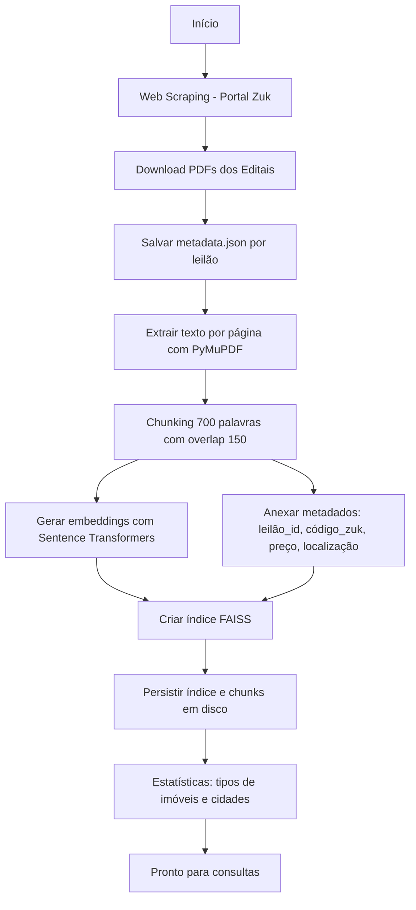
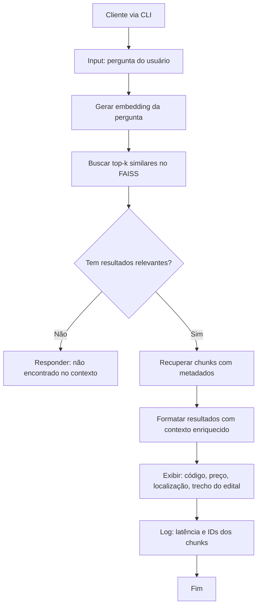

# Assistente de Leilões

Um sistema inteligente para coleta e consulta de dados de leilões de imóveis do Portal Zuk.

## 📋 Visão Geral

Este projeto combina web scraping e RAG (Retrieval-Augmented Generation) para automatizar a coleta e análise de editais de leilões de imóveis, oferecendo uma interface de busca semântica para consultar informações dos imóveis leiloados.

## 🛠️ Funcionalidades

- **Web Scraping**: Coleta automatizada de dados do Portal Zuk
- **Processamento de PDFs**: Extração de texto de editais de leilão
- **Busca Semântica**: Sistema RAG para consultas inteligentes usando FAISS
- **Metadados Estruturados**: Armazenamento organizado de informações dos imóveis

## 🏗️ Estrutura do Projeto

```
assistente_leiloes/
├── web_scrapping/          # Módulo de coleta de dados
│   └── zuk_scrapper.py     # Script para scraping do Portal Zuk
├── rag/                    # Sistema de busca semântica
│   ├── ingest.py          # Processamento e indexação de documentos
│   └── ask.py             # Interface de consulta
├── leiloes/               # Dados coletados organizados por leilão
│   └── leilao_xxxxx_/     # Pasta de cada leilão com PDFs e metadados
└── requirements.txt       # Dependências do projeto
```

## 🚀 Como Usar

### 1. Instalação
```bash
pip install -r requirements.txt
```

### 2. Coleta de Dados
Execute o scraper para coletar novos leilões:
```bash
cd web_scrapping
python zuk_scrapper.py
```

### 3. Indexação
Processe e indexe os documentos coletados:
```bash
cd rag
python ingest.py
```

### 4. Consulta
Faça consultas semânticas nos dados:
```bash
cd rag
python ask.py
```

## � Fluxo de Processamento

### 1. Pipeline de Ingestão de Dados


### 2. Pipeline de Consulta


## �🔍 Exemplo de Consulta

```
Digite sua pergunta: apartamento vila independencia preco ate 200000
```

O sistema retornará informações relevantes com:
- Código do imóvel
- Preço
- Localização (cidade/bairro)
- Trechos do edital
- Número da página no documento

## 📦 Dependências Principais

- **Selenium**: Web scraping automatizado
- **PyMuPDF**: Processamento de arquivos PDF
- **FAISS**: Busca vetorial eficiente
- **Sentence Transformers**: Embeddings semânticos multilíngues
- **FastAPI**: API web (planejado)

## 🎯 Dados Coletados

Para cada leilão, o sistema coleta:
- Edital completo em PDF
- Metadados estruturados (preço, localização, tipo)
- Página HTML original
- Informações do comitente e tribunal

## 🤖 Tecnologias

- Python 3.x
- FAISS para busca vetorial
- Transformers para embeddings
- Selenium WebDriver
- PyMuPDF para processamento de PDFs

---

> **Nota**: Este projeto destina-se ao estudo e análise de dados públicos de leilões judiciais para fins educacionais e de pesquisa.
